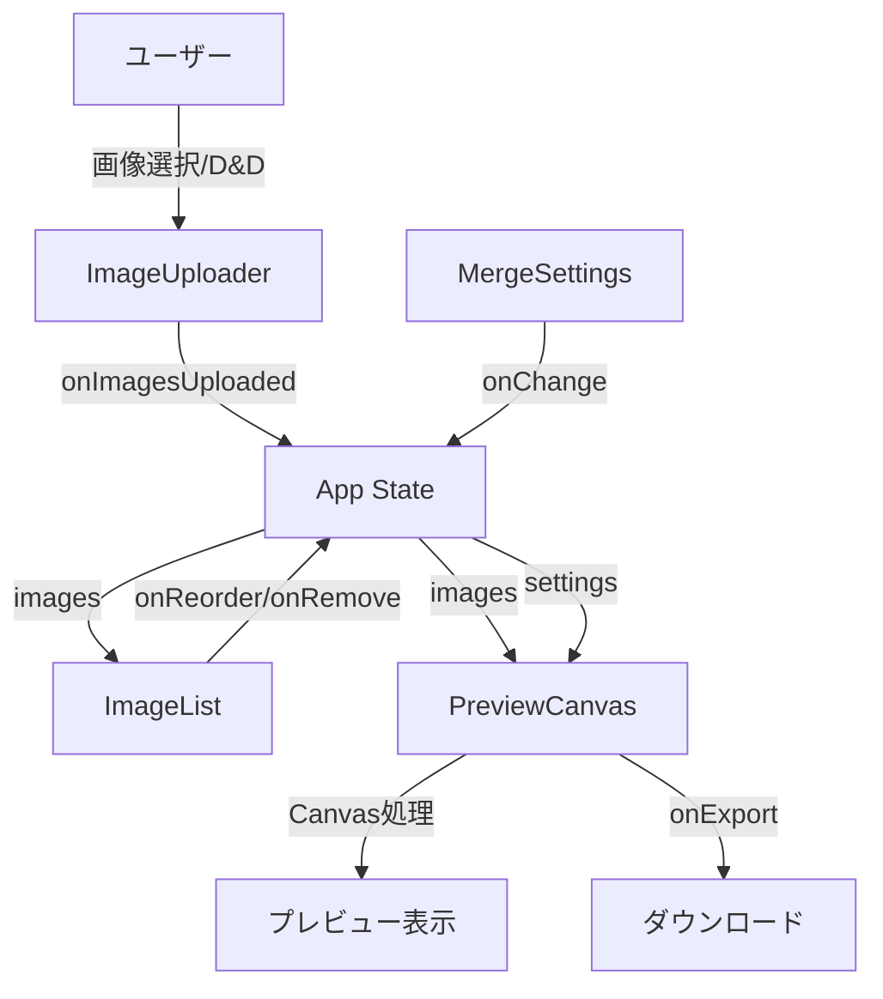

# 初回実装設計書

## 概要
「ガゾウツナゲール」の初回実装における技術設計とアーキテクチャを定義します。

## アーキテクチャ概要

### 技術スタック
- **フレームワーク**: Next.js 16.1.1 (App Router)
- **言語**: TypeScript 5.x
- **スタイリング**: Tailwind CSS + Radix Colors
- **画像処理**: HTML5 Canvas API
- **状態管理**: React useState/useReducer
- **ドラッグ&ドロップ**: react-dropzone
- **ソート機能**: @dnd-kit/sortable

## ディレクトリ構造

```
packages/
├── web/                           # Webアプリケーション
│   ├── src/
│   │   ├── app/                   # Next.js App Router（ルーティングのみ）
│   │   │   ├── layout.tsx
│   │   │   └── page.tsx
│   │   ├── views/                # ページコンポーネント
│   │   │   └── home/
│   │   │       ├── HomePage.tsx
│   │   │       └── index.tsx
│   │   ├── features/              # 機能別モジュール
│   │   │   └── image-merge/       # 画像結合機能
│   │   │       ├── ui/            # UIコンポーネント
│   │   │       │   ├── ImageUploader/
│   │   │       │   │   ├── ImageUploader.tsx
│   │   │       │   │   └── index.tsx
│   │   │       │   ├── ImageList/
│   │   │       │   │   ├── ImageList.tsx
│   │   │       │   │   └── index.tsx
│   │   │       │   ├── MergeSettings/
│   │   │       │   │   ├── MergeSettings.tsx
│   │   │       │   │   └── index.tsx
│   │   │       │   └── PreviewCanvas/
│   │   │       │       ├── PreviewCanvas.tsx
│   │   │       │       └── index.tsx
│   │   │       ├── hooks/         # カスタムフック
│   │   │       │   ├── useImageMerge/
│   │   │       │   │   ├── useImageMerge.ts
│   │   │       │   │   └── index.ts
│   │   │       │   └── useImageUpload/
│   │   │       │       ├── useImageUpload.ts
│   │   │       │       └── index.ts
│   │   │       ├── utils/         # ユーティリティ
│   │   │       │   ├── canvas/
│   │   │       │   │   ├── canvas.ts
│   │   │       │   │   └── index.ts
│   │   │       │   └── image/
│   │   │       │       ├── image.ts
│   │   │       │       └── index.ts
│   │   │       └── types/         # 型定義
│   │   │           └── index.ts
│   │   └── shared/                # 共有リソース
│   │       ├── ui/                # 共通UIコンポーネント
│   │       │   ├── Button/
│   │       │   │   ├── Button.tsx
│   │       │   │   └── index.tsx
│   │       │   └── LoadingSpinner/
│   │       │       ├── LoadingSpinner.tsx
│   │       │       └── index.tsx
│   │       └── styles/            # グローバルスタイル
│   │           └── globals.css
│   ├── public/                    # 静的ファイル
│   └── tests/                     # テストファイル
│       └── fixtures/              # テスト用画像
└── docs/                          # ドキュメント（既存）
```

## ページ構成

### app/page.tsx（ルーティングファイル）
```typescript
// app/page.tsx
export { HomePage as default } from '@/views/home';
```

### views/home/HomePage.tsx（実際のページコンポーネント）
```typescript
// views/home/HomePage.tsx
export const HomePage: React.FC = () => {
  // ページのロジックとレンダリング
};
```

## コンポーネント設計

### 1. ImageUploader
**責務**: 画像のアップロード処理

```typescript
type ImageUploaderProps = {
  onImagesUploaded: (files: ImageFile[]) => void;
  maxFiles: number;
  maxFileSize: number;
}
```

**機能:**
- ドラッグ&ドロップ対応（react-dropzone使用）
- ファイル選択ダイアログ
- ファイル検証（形式、サイズ）
- エラーハンドリング

### 2. ImageList
**責務**: アップロードした画像の一覧表示と順序変更

```typescript
type ImageListProps = {
  images: ImageFile[];
  onReorder: (images: ImageFile[]) => void;
  onRemove: (id: string) => void;
}
```

**機能:**
- サムネイル表示
- ドラッグ&ドロップによる順序変更（@dnd-kit/sortable使用）
- 画像の削除

### 3. MergeSettings
**責務**: 結合設定の管理

```typescript
type MergeSettingsProps = {
  settings: MergeOptions;
  onChange: (settings: MergeOptions) => void;
}

type MergeOptions = {
  arrangement: 'horizontal' | 'vertical';
  gap: number;
}
```

**機能:**
- 配置方法の選択（横並び/縦並び）
- 間隔設定（初回実装では0固定）

### 4. PreviewCanvas
**責務**: 結合結果のリアルタイムプレビュー

```typescript
type PreviewCanvasProps = {
  images: ImageFile[];
  settings: MergeOptions;
  onExport: () => void;
}
```

**機能:**
- Canvas APIを使用した画像結合
- リアルタイムプレビュー更新
- エクスポートボタン

## データフロー



## 状態管理

### アプリケーション状態
```typescript
type AppState = {
  images: ImageFile[];
  settings: MergeOptions;
  isProcessing: boolean;
}

type ImageFile = {
  id: string;
  file: File;
  preview: string; // Object URL
  dimensions: {
    width: number;
    height: number;
  };
}
```

### 状態更新フロー
1. **画像アップロード**: FileをImageFileに変換して状態に追加
2. **順序変更**: images配列を新しい順序で更新
3. **削除**: 指定IDの画像を配列から削除
4. **設定変更**: settingsオブジェクトを更新

## 画像処理ロジック

### Canvas処理フロー
```typescript
// utils/canvas.ts
export const mergeImages = async (
  images: ImageFile[],
  options: MergeOptions
): Promise<Blob> => {
  // 1. 全画像の読み込み
  const loadedImages = await Promise.all(
    images.map(img => loadImage(img.preview))
  );

  // 2. キャンバスサイズ計算
  const canvasSize = calculateCanvasSize(loadedImages, options);

  // 3. オフスクリーンキャンバス作成
  const canvas = new OffscreenCanvas(
    canvasSize.width,
    canvasSize.height
  );

  // 4. 画像を配置・描画
  const ctx = canvas.getContext('2d');
  drawImages(ctx, loadedImages, options);

  // 5. Blob化して返却
  return canvas.convertToBlob({ type: 'image/png' });
}
```

### メモリ管理
- Object URLは使用後に`URL.revokeObjectURL()`で解放
- 大きな画像の処理時は段階的にメモリを解放
- useEffectのクリーンアップでリソース解放

## エラーハンドリング

### エラーの種類と対応
1. **ファイル形式エラー**
   - メッセージ: "対応していないファイル形式です（JPEG、PNGのみ対応）"
   - 処理: 該当ファイルをスキップ

2. **ファイルサイズエラー**
   - メッセージ: "ファイルサイズが10MBを超えています"
   - 処理: 該当ファイルをスキップ

3. **画像読み込みエラー**
   - メッセージ: "画像の読み込みに失敗しました"
   - 処理: エラー画像を除外して処理継続

4. **メモリ不足エラー**
   - メッセージ: "画像の処理中にエラーが発生しました"
   - 処理: 処理を中断

## パフォーマンス最適化

### 1. 画像のサムネイル生成
```typescript
const createThumbnail = (file: File): Promise<string> => {
  // 最大200x200のサムネイルを生成
  // Web Workerは使用せず、メインスレッドで処理（初回実装）
}
```

### 2. プレビューの最適化
- デバウンス処理（設定変更時）
- 低解像度プレビュー（実際の1/4サイズ）
- requestAnimationFrameを使用した描画

### 3. メモリ使用量の削減
- 不要なObject URLの即座解放
- 画像処理完了後のImageオブジェクト解放

## テスト戦略

### Unit Tests (Vitest)
- `utils/canvas.ts`: 画像結合ロジック
- `utils/image.ts`: 画像検証・変換ロジック
- カスタムフック: 状態管理ロジック

### Component Tests (React Testing Library)
- 各コンポーネントの表示・インタラクション
- エラー状態の表示
- アクセシビリティ

### E2E Tests (Playwright)
- 画像アップロード → 順序変更 → ダウンロードの完全フロー
- エラーケースの動作確認
- 複数ブラウザでの動作確認

## セキュリティ考慮事項

1. **ファイル検証**
   - MIMEタイプの確認
   - ファイルヘッダーの検証
   - ファイルサイズ制限

2. **XSS対策**
   - ファイル名のサニタイズ
   - Object URLの適切な管理

3. **リソース制限**
   - 同時アップロード数の制限
   - 総メモリ使用量の監視

## 今後の拡張ポイント

設計時点で以下の拡張を考慮：

1. **Web Worker対応**
   - 重い画像処理をバックグラウンドで実行
   - Web Worker通信ライブラリの使用を想定

2. **プラグイン機構**
   - 画像フィルター追加
   - 新しい配置パターン追加

3. **設定の永続化**
   - LocalStorageへの保存
   - 設定のエクスポート/インポート