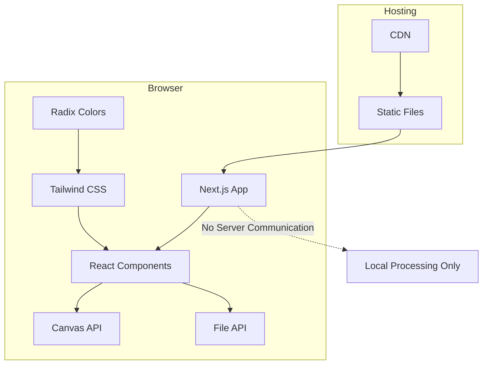

# 技術仕様書 - ガゾウツナゲール

## 1. 技術スタック概要

### フロントエンド
- **Framework**: Next.js 16.x (App Router)
- **Language**: TypeScript 5.x
- **Styling**: Tailwind CSS 4.x + Radix Colors
- **Runtime**: React 19.x

### 開発・ビルドツール
- **Package Manager**: pnpm
- **Linter**: ESLint 9.x
- **Type Checker**: TypeScript
- **Build Tool**: Next.js (Turbopack)

### ブラウザAPI
- **Canvas API**: 画像結合処理
- **File API**: ファイルアップロード処理
- **Drag & Drop API**: ファイルドラッグ&ドロップ

## 2. アーキテクチャ設計

### 2.1 全体構成



### 2.2 pnpmワークスペース構成（モノレポ）

本プロジェクトはpnpmワークスペース機能を使用したモノレポ構成を採用します。

```
gazoutsunage-ru/                  # ルートディレクトリ
├── pnpm-workspace.yaml          # ワークスペース設定
├── package.json                 # ルート package.json
├── packages/                    # すべてのパッケージ
│   ├── web/                     # Webアプリケーション（メイン）
│   │   ├── package.json
│   │   ├── next.config.ts
│   │   ├── tailwind.config.ts
│   │   └── src/
│   │       ├── app/             # Next.js App Router
│   │       ├── features/        # 機能レイヤー
│   │       └── shared/          # アプリ内共通レイヤー
│   └── ui/                      # 汎用UIコンポーネント（将来分離予定）
│       ├── package.json         # 現在は未使用、将来の汎用化時に活用
│       ├── src/
│       │   ├── components/      # 汎用コンポーネント
│       │   └── index.ts
│       └── tsconfig.json
├── tools/                       # 開発ツール
│   ├── eslint-config/           # ESLint共通設定
│   └── tsconfig/                # TypeScript共通設定
├── tests/                       # E2Eテスト
│   ├── fixtures/
│   └── e2e/
└── docs/                        # ドキュメント
```

### 2.3 ワークスペース設定

#### pnpm-workspace.yaml
```yaml
packages:
  - 'packages/*'
  - 'tools/*'
```

#### ルートpackage.json
```json
{
  "name": "gazoutsunage-ru",
  "private": true,
  "scripts": {
    "dev": "pnpm --filter web dev",
    "build": "pnpm --filter web build",
    "test": "pnpm --filter \"*\" test",
    "test:e2e": "playwright test",
    "lint": "pnpm --filter \"*\" lint",
    "type-check": "pnpm --filter \"*\" type-check",
    "clean": "pnpm --filter \"*\" clean"
  },
  "devDependencies": {
    "@playwright/test": "^1.40.0",
    "typescript": "^5.0.0"
  }
}
```

#### packages/web/package.json
```json
{
  "name": "@gazoutsunage-ru/web",
  "private": true,
  "scripts": {
    "dev": "next dev",
    "build": "next build",
    "start": "next start",
    "lint": "eslint . --ext .ts,.tsx",
    "type-check": "tsc --noEmit"
  },
  "dependencies": {
    "next": "^16.x",
    "react": "^19.x",
    "react-dom": "^19.x",
    "@gazoutsunage-ru/ui": "workspace:*"
  },
  "devDependencies": {
    "@gazoutsunage-ru/eslint-config": "workspace:*",
    "@gazoutsunage-ru/tsconfig": "workspace:*",
    "@types/react": "^19.x",
    "typescript": "^5.x"
  }
}
```

### 2.4 現在の開発方針

#### 初期段階での構成
現在は単一Webアプリケーションとして開発を進めます。汎用UIコンポーネント（packages/ui）は将来の分離に備えて準備しますが、当面は使用しません。

```
packages/web/src/
├── app/                          # Next.js App Router
│   ├── page.tsx                 # メインページ
│   ├── layout.tsx               # レイアウト
│   └── globals.css              # グローバルスタイル
├── features/                     # 機能レイヤー
│   └── image-merger/            # 画像結合機能
│       ├── ui/                 # UI
│       │   ├── upload-zone.tsx
│       │   ├── control-panel.tsx
│       │   ├── preview-area.tsx
│       │   └── image-thumbnail.tsx
│       ├── lib/                # ロジック
│       │   ├── use-image-merger.ts
│       │   └── image-combiner.ts
│       └── types/              # 機能固有の型定義
│           └── merger.ts
└── shared/                       # アプリ内共通レイヤー
    ├── ui/                      # UIコンポーネント（現時点ではこちらを使用）
    │   ├── button/
    │   ├── slider/
    │   └── upload-zone/
    ├── lib/                     # ユーティリティ関数
    │   ├── canvas.ts
    │   ├── file-validator.ts
    │   └── image-processor.ts
    └── types/                   # 共通型定義
        └── image.ts
```

#### 将来的な汎用化戦略
プロダクトが成熟し、他のプロジェクトでも再利用可能なコンポーネントが明確になった段階で：

1. **packages/ui への移行**: 汎用性の高いUIコンポーネント（Button、Modal等）
2. **外部公開**: npm パッケージとしての公開検討
3. **バージョン管理**: セマンティックバージョニングの導入

### 2.3 状態管理設計

```typescript
// Context API を使用したシンプルな状態管理
interface ImageMergerState {
  images: ImageItem[]
  arrangement: 'horizontal' | 'vertical'
  margin: number
  isProcessing: boolean
}

interface ImageItem {
  id: string
  file: File
  preview: string    // Data URL
  order: number
  thumbnail: string  // 小さなプレビュー用
}

// Context Provider
const ImageMergerProvider: React.FC<{ children: React.ReactNode }> = ({ children }) => {
  const [state, dispatch] = useReducer(imageMergerReducer, initialState)
  
  return (
    <ImageMergerContext.Provider value={{ state, dispatch }}>
      {children}
    </ImageMergerContext.Provider>
  )
}
```

## 3. 画像処理ライブラリの選定

### 3.1 Canvas API（選定理由）
- **ネイティブサポート**: モダンブラウザで標準対応
- **パフォーマンス**: ハードウェア支援を受けて高速
- **セキュリティ**: クライアントサイド完結
- **軽量**: 追加ライブラリ不要

### 3.2 代替案との比較

| 項目 | Canvas API | fabric.js | Konva.js | 判定 |
|------|-----------|-----------|----------|------|
| ファイルサイズ | 0KB (ネイティブ) | 300KB+ | 500KB+ | ◎ |
| 学習コスト | 低 | 中 | 高 | ◎ |
| 機能性 | シンプル結合に十分 | 高機能 | 高機能 | ◎ |
| ブラウザ対応 | 99%+ | 95%+ | 95%+ | ◎ |
| メンテナンス性 | 標準API | サードパーティ | サードパーティ | ◎ |

## 4. パフォーマンス最適化戦略

### 4.1 画像処理の最適化

#### オフスクリーンキャンバス
```typescript
// 重い処理をメインスレッドから分離
const processImageOffscreen = (images: ImageItem[]): Promise<string> => {
  return new Promise((resolve) => {
    const offscreenCanvas = new OffscreenCanvas(width, height)
    const ctx = offscreenCanvas.getContext('2d')
    
    // バックグラウンドで画像結合処理
    setTimeout(() => {
      // 結合処理
      const dataUrl = offscreenCanvas.convertToBlob()
      resolve(URL.createObjectURL(dataUrl))
    }, 0)
  })
}
```

#### 段階的画像読み込み
```typescript
const loadImagesProgressively = async (files: File[]): Promise<ImageItem[]> => {
  const results: ImageItem[] = []
  
  for (const file of files) {
    // 1枚ずつ処理してUIをブロックしない
    const imageItem = await processImage(file)
    results.push(imageItem)
    
    // UIを更新
    yield imageItem
  }
  
  return results
}
```

### 4.2 メモリ管理

#### オブジェクトURLの管理
```typescript
const createImagePreview = (file: File): string => {
  const url = URL.createObjectURL(file)
  
  // クリーンアップ関数を登録
  cleanupCallbacks.add(() => URL.revokeObjectURL(url))
  
  return url
}

const cleanup = () => {
  cleanupCallbacks.forEach(callback => callback())
  cleanupCallbacks.clear()
}
```

#### Canvas要素の再利用
```typescript
class CanvasPool {
  private pool: HTMLCanvasElement[] = []
  
  getCanvas(): HTMLCanvasElement {
    return this.pool.pop() || document.createElement('canvas')
  }
  
  releaseCanvas(canvas: HTMLCanvasElement): void {
    // キャンバスをクリアして再利用可能にする
    const ctx = canvas.getContext('2d')
    ctx?.clearRect(0, 0, canvas.width, canvas.height)
    this.pool.push(canvas)
  }
}
```

### 4.3 バンドル最適化

#### Next.js設定
```typescript
// next.config.ts
const nextConfig = {
  // Turbopack を有効化（開発時）
  experimental: {
    turbo: {
      rules: {
        '*.svg': ['@svgr/webpack']
      }
    }
  },
  
  // 本番ビルド最適化
  compiler: {
    removeConsole: process.env.NODE_ENV === 'production'
  },
  
  // 画像最適化
  images: {
    formats: ['image/webp', 'image/avif']
  }
}
```

#### Dynamic Import
```typescript
// 大きなライブラリは動的インポート
const loadImageProcessor = async () => {
  const { ImageProcessor } = await import('../lib/heavy-image-processor')
  return new ImageProcessor()
}
```

## 5. ブラウザ対応要件

### 5.1 サポート対象ブラウザ

| ブラウザ | 最低バージョン | 対応理由 |
|----------|---------------|----------|
| Chrome | 90+ | Canvas API、File API完全対応 |
| Safari | 14+ | iOS対応、Canvas API対応 |
| Firefox | 88+ | プライバシー重視ユーザー層 |
| Edge | 90+ | ビジネス利用でのシェア |

### 5.2 機能検出とフォールバック

```typescript
const checkBrowserSupport = (): BrowserSupport => {
  return {
    canvas: !!document.createElement('canvas').getContext('2d'),
    fileAPI: !!(window.File && window.FileReader && window.FileList),
    dragDrop: 'ondrop' in document.createElement('div'),
    offscreenCanvas: !!window.OffscreenCanvas
  }
}

const BrowserCompatibilityCheck: React.FC = () => {
  const support = checkBrowserSupport()
  
  if (!support.canvas || !support.fileAPI) {
    return (
      <div className="error-message">
        お使いのブラウザは対応していません。
        Chrome、Safari、Firefox、Edgeの最新版をお使いください。
      </div>
    )
  }
  
  return <ImageMergerApp />
}
```

## 6. セキュリティ仕様

### 6.1 Content Security Policy

```http
Content-Security-Policy: 
  default-src 'self';
  script-src 'self';
  style-src 'self' 'unsafe-inline';
  img-src 'self' data: blob:;
  connect-src 'none';
  form-action 'none';
  base-uri 'none';
```

### 6.2 ファイル検証

```typescript
interface FileValidation {
  maxSize: number        // 5MB
  maxFiles: number      // 10枚
  allowedTypes: string[] // ['image/jpeg', 'image/png']
}

const validateFile = (file: File, validation: FileValidation): ValidationResult => {
  // MIME type チェック
  if (!validation.allowedTypes.includes(file.type)) {
    return { valid: false, error: 'ファイル形式が対応していません' }
  }
  
  // ファイルサイズチェック
  if (file.size > validation.maxSize) {
    return { valid: false, error: 'ファイルサイズが大きすぎます' }
  }
  
  // ファイル名サニタイズ
  const safeName = file.name.replace(/[<>:"/\\|?*]/g, '_')
  
  return { valid: true, safeName }
}
```

### 6.3 XSS対策

```typescript
// DOMPurifyは使用せず、React の仕組みを活用
const SafeFileDisplay: React.FC<{ fileName: string }> = ({ fileName }) => {
  // React が自動的にエスケープするため安全
  return <span>{fileName}</span>
}

// innerHTML は使用禁止
// 代わりに React の仕組みを使用
const ErrorMessage: React.FC<{ message: string }> = ({ message }) => {
  return <div className="error">{message}</div>
}
```

## 7. 開発環境設定

### 7.1 必要なツール

```json
{
  "engines": {
    "node": ">=18.0.0",
    "pnpm": ">=8.0.0"
  },
  "scripts": {
    "dev": "next dev",
    "build": "next build",
    "start": "next start",
    "lint": "eslint src --ext .ts,.tsx",
    "type-check": "tsc --noEmit"
  }
}
```

### 7.2 ESLint設定

```typescript
// eslint.config.mjs
export default [
  {
    files: ['**/*.{ts,tsx}'],
    rules: {
      // セキュリティルール
      'react/no-danger': 'error',
      'react/no-danger-with-children': 'error',
      
      // パフォーマンスルール
      'react-hooks/exhaustive-deps': 'error',
      
      // コード品質
      '@typescript-eslint/no-unused-vars': 'error',
      '@typescript-eslint/explicit-function-return-type': 'warn'
    }
  }
]
```

### 7.3 TypeScript設定

```json
{
  "compilerOptions": {
    "target": "ES2022",
    "lib": ["dom", "dom.iterable", "es6"],
    "allowJs": true,
    "skipLibCheck": true,
    "strict": true,
    "forceConsistentCasingInFileNames": true,
    "noEmit": true,
    "esModuleInterop": true,
    "module": "esnext",
    "moduleResolution": "bundler",
    "resolveJsonModule": true,
    "isolatedModules": true,
    "jsx": "preserve",
    "incremental": true,
    "plugins": [
      {
        "name": "next"
      }
    ],
    "paths": {
      "@/*": ["./src/*"]
    }
  },
  "include": ["next-env.d.ts", "**/*.ts", "**/*.tsx", ".next/types/**/*.ts"],
  "exclude": ["node_modules"]
}
```

## 8. デプロイメント戦略

### 8.1 静的サイト生成

```typescript
// next.config.ts
const nextConfig = {
  output: 'export',    // 静的サイトとして出力
  trailingSlash: true, // CDN互換性
  images: {
    unoptimized: true  // 静的サイトでは画像最適化を無効化
  }
}
```

### 8.2 ホスティング要件

| 項目 | 要件 | 推奨サービス |
|------|------|--------------|
| HTTPSサポート | 必須 | Vercel、Netlify、CloudFlare Pages |
| CDN | 必須 | 上記サービスで自動対応 |
| カスタムヘッダー | CSP設定のため必須 | 上記サービスで対応 |
| SPA対応 | 不要（Static Export） | - |

### 8.3 CI/CD設定例（GitHub Actions）

```yaml
name: Deploy

on:
  push:
    branches: [ main ]

jobs:
  deploy:
    runs-on: ubuntu-latest
    
    steps:
      - uses: actions/checkout@v4
      
      - name: Setup Node.js
        uses: actions/setup-node@v4
        with:
          node-version: '18'
          cache: 'pnpm'
      
      - name: Install dependencies
        run: pnpm install --frozen-lockfile
      
      - name: Type check
        run: pnpm type-check
      
      - name: Lint
        run: pnpm lint
      
      - name: Build
        run: pnpm build
      
      - name: Deploy to Vercel
        uses: vercel/action@v1
        with:
          vercel-token: ${{ secrets.VERCEL_TOKEN }}
```

## 9. 監視・分析

### 9.1 パフォーマンス監視

```typescript
// Core Web Vitals 測定
const measurePerformance = () => {
  // Largest Contentful Paint
  new PerformanceObserver((list) => {
    const entries = list.getEntries()
    const lastEntry = entries[entries.length - 1]
    console.log('LCP:', lastEntry.startTime)
  }).observe({ entryTypes: ['largest-contentful-paint'] })
  
  // First Input Delay
  new PerformanceObserver((list) => {
    const entries = list.getEntries()
    entries.forEach((entry) => {
      console.log('FID:', entry.processingStart - entry.startTime)
    })
  }).observe({ entryTypes: ['first-input'] })
}
```

### 9.2 エラートラッキング

```typescript
// 簡単なエラーログ
window.addEventListener('error', (event) => {
  console.error('Global Error:', {
    message: event.message,
    filename: event.filename,
    lineno: event.lineno,
    colno: event.colno,
    error: event.error
  })
})

// Canvas エラーの特別処理
const handleCanvasError = (error: Error) => {
  console.error('Canvas Error:', error.message)
  
  // ユーザーにフレンドリーなメッセージを表示
  if (error.message.includes('memory')) {
    showError('画像が大きすぎます。数を減らしてください。')
  } else {
    showError('画像処理中にエラーが発生しました。')
  }
}
```

## 10. 技術的制約と対策

### 10.1 ブラウザ制限

| 制限項目 | 制限値 | 対策 |
|---------|--------|------|
| Canvas最大サイズ | ブラウザ依存 (通常32767px) | 事前チェックと警告 |
| メモリ使用量 | デバイス依存 | 段階的処理、ガベージコレクション |
| ファイルAPI制限 | 同時読み込み数 | キューイング処理 |

### 10.2 パフォーマンス制約

```typescript
// 大きな画像の処理制限
const MAX_CANVAS_SIZE = 16384 // 安全な最大サイズ
const MAX_TOTAL_PIXELS = 268435456 // 16384 * 16384

const checkImageConstraints = (images: ImageItem[]): boolean => {
  const totalPixels = images.reduce((sum, img) => {
    return sum + (img.width * img.height)
  }, 0)
  
  return totalPixels <= MAX_TOTAL_PIXELS
}
```

## 11. テストアーキテクチャ

### 11.1 テスト環境設定

#### Vitest設定
```typescript
// vitest.config.ts
import { defineConfig } from 'vitest/config'
import react from '@vitejs/plugin-react'
import path from 'path'

export default defineConfig({
  plugins: [react()],
  test: {
    globals: true,
    environment: 'jsdom',
    setupFiles: ['./src/test/setup.ts'],
    coverage: {
      provider: 'v8',
      reporter: ['text', 'json', 'html'],
      thresholds: {
        global: {
          branches: 80,
          functions: 80,
          lines: 80,
          statements: 80
        }
      }
    }
  },
  resolve: {
    alias: {
      '@': path.resolve(__dirname, './src')
    }
  }
})
```

#### Playwright設定
```typescript
// playwright.config.ts
import { defineConfig, devices } from '@playwright/test'

export default defineConfig({
  testDir: './tests/e2e',
  fullyParallel: true,
  forbidOnly: !!process.env.CI,
  retries: process.env.CI ? 2 : 0,
  workers: process.env.CI ? 1 : undefined,
  reporter: 'html',
  use: {
    baseURL: 'http://127.0.0.1:3000',
    trace: 'on-first-retry',
    screenshot: 'only-on-failure'
  },
  projects: [
    {
      name: 'chromium',
      use: { ...devices['Desktop Chrome'] },
    },
    {
      name: 'firefox',
      use: { ...devices['Desktop Firefox'] },
    },
    {
      name: 'webkit',
      use: { ...devices['Desktop Safari'] },
    },
    {
      name: 'Mobile Chrome',
      use: { ...devices['Pixel 5'] },
    }
  ],
  webServer: {
    command: 'pnpm dev',
    url: 'http://127.0.0.1:3000',
    reuseExistingServer: !process.env.CI,
  }
})
```

### 11.2 テストパターン

#### 画像処理ロジックのテスト
```typescript
// src/shared/lib/__tests__/image-processor.test.ts
import { describe, it, expect, vi } from 'vitest'
import { combineImages } from '../image-processor'
import { createMockCanvas } from '../../test/mocks/canvas'

describe('画像処理', () => {
  it('横並び配置で画像を結合できる', async () => {
    const mockCanvas = createMockCanvas()
    vi.spyOn(document, 'createElement').mockReturnValue(mockCanvas)
    
    const images = [
      { width: 100, height: 100, data: 'data:image/png;base64,...' },
      { width: 200, height: 150, data: 'data:image/png;base64,...' }
    ]
    
    const result = await combineImages(images, {
      arrangement: 'horizontal',
      margin: 10
    })
    
    expect(result).toBeDefined()
    expect(mockCanvas.width).toBe(320) // 100 + 200 + 10*2
    expect(mockCanvas.height).toBe(150) // max height
  })
  
  it('大きすぎる画像でエラーが発生する', async () => {
    const largeImages = [
      { width: 20000, height: 20000, data: 'data:image/png;base64,...' }
    ]
    
    await expect(
      combineImages(largeImages, { arrangement: 'horizontal', margin: 0 })
    ).rejects.toThrow('画像が大きすぎます')
  })
})
```

#### コンポーネントテスト
```typescript
// src/features/image-merger/ui/__tests__/upload-zone.test.tsx
import { describe, it, expect, vi } from 'vitest'
import { render, screen, fireEvent } from '@testing-library/react'
import { UploadZone } from '../upload-zone'

describe('UploadZone', () => {
  it('ファイル選択時にonFilesSelectedが呼ばれる', () => {
    const mockOnFilesSelected = vi.fn()
    render(<UploadZone onFilesSelected={mockOnFilesSelected} />)
    
    const input = screen.getByRole('button', { name: /画像を選択/ })
    const file = new File(['dummy'], 'test.jpg', { type: 'image/jpeg' })
    
    fireEvent.change(input, { target: { files: [file] } })
    
    expect(mockOnFilesSelected).toHaveBeenCalledWith([file])
  })
  
  it('無効なファイル形式でエラーメッセージが表示される', () => {
    const mockOnFilesSelected = vi.fn()
    render(<UploadZone onFilesSelected={mockOnFilesSelected} />)
    
    const input = screen.getByRole('button', { name: /画像を選択/ })
    const file = new File(['dummy'], 'test.txt', { type: 'text/plain' })
    
    fireEvent.change(input, { target: { files: [file] } })
    
    expect(screen.getByText(/対応形式はJPEGとPNGのみです/)).toBeInTheDocument()
    expect(mockOnFilesSelected).not.toHaveBeenCalled()
  })
})
```

#### E2Eテスト
```typescript
// tests/e2e/image-merger.spec.ts
import { test, expect } from '@playwright/test'
import path from 'path'

test.describe('画像結合フロー', () => {
  test('2枚の画像を横並びで結合してダウンロードできる', async ({ page }) => {
    await page.goto('/')
    
    // 画像をアップロード
    const fileChooserPromise = page.waitForEvent('filechooser')
    await page.getByText('画像を選択').click()
    const fileChooser = await fileChooserPromise
    await fileChooser.setFiles([
      path.join(__dirname, '../fixtures/images/sample1.jpg'),
      path.join(__dirname, '../fixtures/images/sample2.jpg')
    ])
    
    // プレビューが表示されることを確認
    await expect(page.getByTestId('image-thumbnail')).toHaveCount(2)
    
    // 横並び配置を選択
    await page.getByLabel('横並び').check()
    
    // 余白を調整
    await page.getByTestId('margin-slider').fill('20')
    
    // プレビューが更新されることを確認
    await expect(page.getByTestId('preview-canvas')).toBeVisible()
    
    // ダウンロード
    const downloadPromise = page.waitForEvent('download')
    await page.getByText('ダウンロード').click()
    const download = await downloadPromise
    
    // ファイル名が正しいことを確認
    expect(download.suggestedFilename()).toMatch(/^merged_\d{8}_\d{6}\.png$/)
  })
  
  test('ドラッグ&ドロップで画像をアップロードできる', async ({ page }) => {
    await page.goto('/')
    
    // ファイルをドラッグ&ドロップ
    const filePath = path.join(__dirname, '../fixtures/images/sample1.jpg')
    await page.setInputFiles('[data-testid="upload-zone"]', filePath)
    
    // アップロードされた画像が表示されることを確認
    await expect(page.getByTestId('image-thumbnail')).toHaveCount(1)
  })
  
  test('大きすぎるファイルでエラーメッセージが表示される', async ({ page }) => {
    await page.goto('/')
    
    const fileChooserPromise = page.waitForEvent('filechooser')
    await page.getByText('画像を選択').click()
    const fileChooser = await fileChooserPromise
    await fileChooser.setFiles([
      path.join(__dirname, '../fixtures/images/large-image.jpg') // 5MB超
    ])
    
    // エラーメッセージが表示されることを確認
    await expect(page.getByText('ファイルサイズは5MB以下にしてください')).toBeVisible()
  })
})

test.describe('クロスブラウザテスト', () => {
  ['chromium', 'firefox', 'webkit'].forEach(browserName => {
    test(`${browserName}で基本機能が動作する`, async ({ browser }) => {
      const context = await browser.newContext()
      const page = await context.newPage()
      await page.goto('/')
      
      // 基本的なUI要素が表示されることを確認
      await expect(page.getByText('ガゾウツナゲール')).toBeVisible()
      await expect(page.getByText('画像を選択')).toBeVisible()
      
      await context.close()
    })
  })
})
```

### 11.3 Visual Regressionテスト
```typescript
// tests/e2e/visual.spec.ts
import { test, expect } from '@playwright/test'

test('UIの視覚的回帰テスト', async ({ page }) => {
  await page.goto('/')
  
  // 初期状態のスクリーンショット
  await expect(page).toHaveScreenshot('initial-state.png')
  
  // 画像アップロード後のスクリーンショット
  await page.setInputFiles('[data-testid="upload-zone"]', 
    'tests/fixtures/images/sample1.jpg')
  await expect(page).toHaveScreenshot('with-uploaded-image.png')
})
```

## 12. 将来の拡張性

### 12.1 機能拡張のアーキテクチャ

```typescript
// プラグインシステムの基盤
interface ImageProcessor {
  process(images: ImageItem[], options: ProcessOptions): Promise<string>
}

class HorizontalProcessor implements ImageProcessor {
  async process(images: ImageItem[], options: ProcessOptions): Promise<string> {
    // 横並び処理
  }
}

class GridProcessor implements ImageProcessor {
  async process(images: ImageItem[], options: ProcessOptions): Promise<string> {
    // グリッド処理（将来拡張）
  }
}

// 処理方式の切り替え
const processorRegistry = new Map<string, ImageProcessor>([
  ['horizontal', new HorizontalProcessor()],
  ['vertical', new VerticalProcessor()],
  // ['grid', new GridProcessor()], // 将来追加
])
```

### 12.2 国際化対応の準備

```typescript
// 多言語対応の基盤
interface Translations {
  [key: string]: string
}

const messages: Record<string, Translations> = {
  ja: {
    'upload.selectFiles': '画像を選択',
    'upload.dragAndDrop': 'ここにドロップ',
    'error.fileSize': 'ファイルサイズが大きすぎます'
  },
  en: {
    'upload.selectFiles': 'Select Images',
    'upload.dragAndDrop': 'Drop here',
    'error.fileSize': 'File size is too large'
  }
}

const useTranslation = () => {
  const locale = 'ja' // 将来的にはブラウザ言語やユーザー設定から取得
  return (key: string) => messages[locale][key] || key
}
```