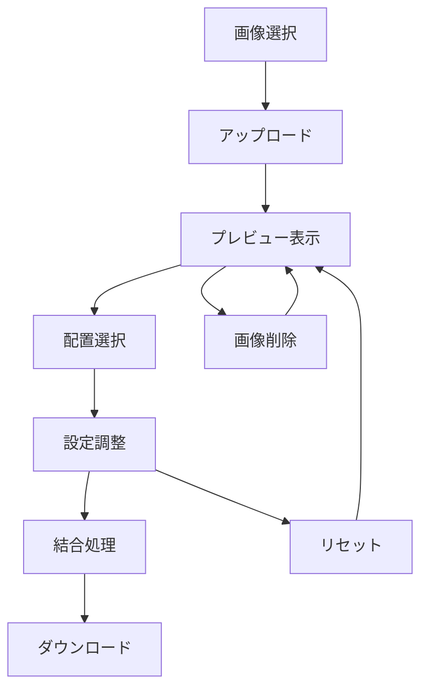
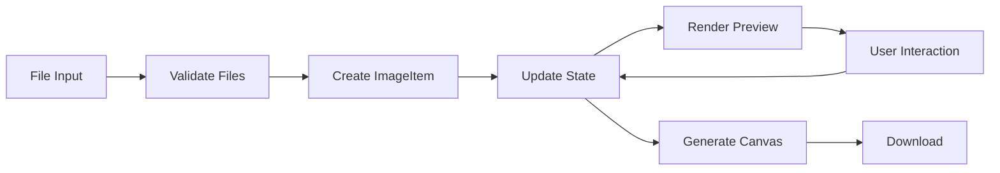
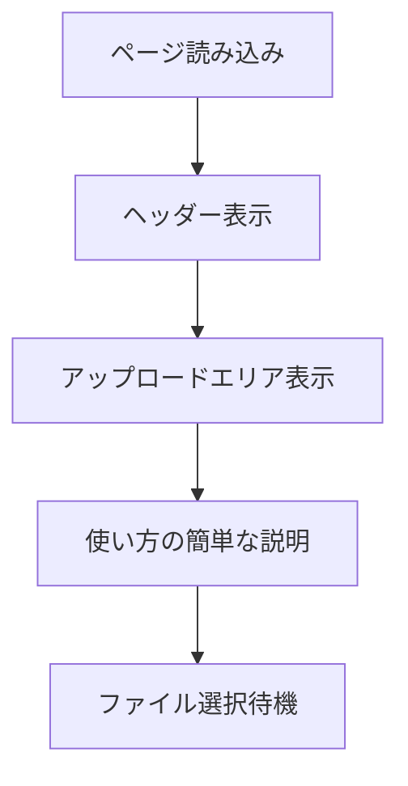
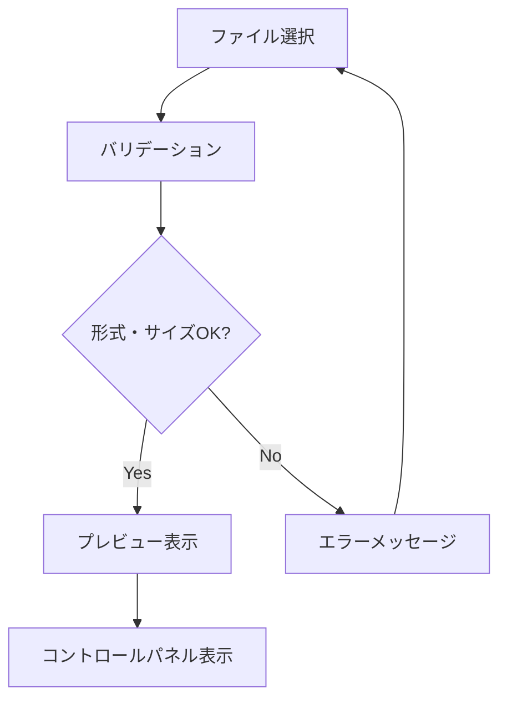
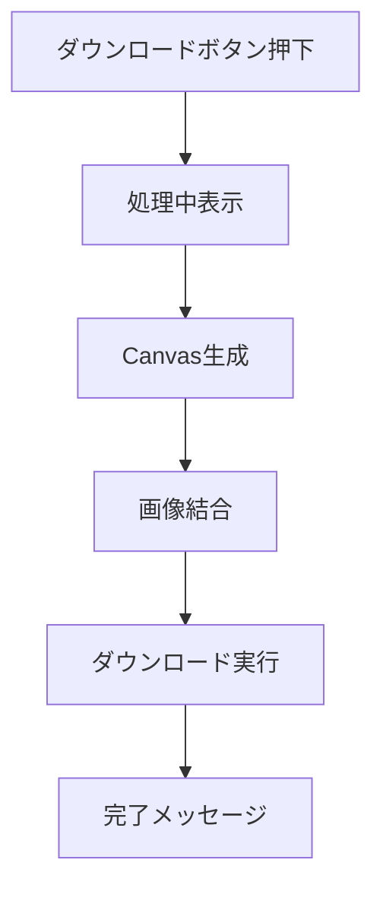

# 機能設計書 - ガゾウツナゲール

## 1. 概要

「ガゾウツナゲール」は、複数の画像を1つの画像に結合するシンプルなWebアプリケーションです。
主に領収書や書類の結合業務に特化し、3ステップで完了する直感的なUIを提供します。

## 2. 画像処理フロー

### 2.1 基本フロー



### 2.2 詳細フロー

#### ステップ1: 画像アップロード
1. ユーザーがファイル選択ボタンをクリック
2. ファイル選択ダイアログが開く
3. 複数ファイルを選択（JPEG/PNG、5MB以下）
4. バリデーション実行
5. アップロード完了後、プレビューエリアに表示

#### ステップ2: 配置・設定
1. 横並び/縦並びの選択（デフォルト：横並び）
2. 余白の調整（0-50px、デフォルト：10px）
3. 画像の並び替え（矢印ボタンで移動）
4. リアルタイムプレビュー更新

#### ステップ3: 結合・ダウンロード
1. 「ダウンロード」ボタンをクリック
2. Canvas APIで画像結合処理
3. **透明背景でPNG形式でダウンロード**

## 3. 画面設計

### 3.1 メイン画面レイアウト

```
┌─────────────────────────────────────────┐
│                 Header                   │
│        ガゾウツナゲール                     │
└─────────────────────────────────────────┘
┌─────────────────────────────────────────┐
│            Upload Area                   │
│   [📁 画像を選択] または ここにドロップ      │
└─────────────────────────────────────────┘
┌─────────────────┬───────────────────────┐
│   Control Panel  │     Preview Area      │
│                 │                       │
│ ○ 横並び         │     [画像1][画像2]     │
│ ○ 縦並び         │                       │
│                 │                       │
│ 余白: [---+---] │                       │
│                 │                       │
│ [全削除]        │                       │
│                 │                       │
│ [ダウンロード]   │                       │
└─────────────────┴───────────────────────┘
```

### 3.2 コンポーネント構成

#### UploadZone
- ファイル選択ボタン
- ドラッグ&ドロップエリア
- アップロード状況表示

#### ControlPanel
- 配置方向選択（ラジオボタン）
- 余白調整スライダー
- 全削除ボタン
- ダウンロードボタン

#### PreviewArea
- アップロード済み画像のサムネイル表示
- 画像並び替え矢印ボタン
- 個別削除ボタン
- 結合結果のプレビュー表示

#### ImageThumbnail
- 画像サムネイル
- ファイル名表示
- 削除ボタン（×）
- 移動ボタン（↑↓ または ←→）

## 4. データフロー定義

### 4.1 状態管理

```typescript
interface AppState {
  images: ImageItem[]
  arrangement: 'horizontal' | 'vertical'
  margin: number
  isProcessing: boolean
}

interface ImageItem {
  id: string
  file: File
  preview: string
  order: number
}
```

### 4.2 データフロー



## 5. UI/UXフロー

### 5.1 初回訪問時



### 5.2 画像アップロード時



### 5.3 結合処理時



## 6. コンポーネント設計

### 6.1 App（メインコンポーネント）
**責務**: 全体の状態管理、各コンポーネントの統合

```typescript
const App: React.FC = () => {
  const [images, setImages] = useState<ImageItem[]>([])
  const [arrangement, setArrangement] = useState<'horizontal' | 'vertical'>('horizontal')
  const [margin, setMargin] = useState(10)
  
  return (
    <div className="app">
      <Header />
      <UploadZone onFilesSelected={handleFilesSelected} />
      <div className="main-content">
        <ControlPanel 
          arrangement={arrangement}
          margin={margin}
          onArrangementChange={setArrangement}
          onMarginChange={setMargin}
          onDownload={handleDownload}
        />
        <PreviewArea images={images} arrangement={arrangement} margin={margin} />
      </div>
    </div>
  )
}
```

### 6.2 UploadZone
**責務**: ファイル選択、ドラッグ&ドロップ、バリデーション

```typescript
interface UploadZoneProps {
  onFilesSelected: (files: File[]) => void
}

const UploadZone: React.FC<UploadZoneProps> = ({ onFilesSelected }) => {
  const handleDrop = (e: DragEvent) => {
    // ドラッグ&ドロップ処理
  }
  
  const handleFileSelect = (e: ChangeEvent<HTMLInputElement>) => {
    // ファイル選択処理
  }
  
  return (
    <div className="upload-zone" onDrop={handleDrop}>
      <input type="file" multiple accept="image/jpeg,image/png" onChange={handleFileSelect} />
      <p>画像を選択 または ここにドロップ</p>
    </div>
  )
}
```

### 6.3 PreviewArea
**責務**: 画像プレビュー、結合結果表示

```typescript
interface PreviewAreaProps {
  images: ImageItem[]
  arrangement: 'horizontal' | 'vertical'
  margin: number
}

const PreviewArea: React.FC<PreviewAreaProps> = ({ images, arrangement, margin }) => {
  return (
    <div className="preview-area">
      <div className="thumbnails">
        {images.map(image => (
          <ImageThumbnail key={image.id} image={image} />
        ))}
      </div>
      <Canvas images={images} arrangement={arrangement} margin={margin} />
    </div>
  )
}
```

## 7. エラーハンドリング

### 7.1 ファイルアップロード時のエラー

| エラー種類 | 条件 | メッセージ | 対応 |
|-----------|------|-----------|------|
| ファイル形式エラー | JPEG/PNG以外 | 「対応形式はJPEGとPNGのみです」 | ファイル選択をリセット |
| ファイルサイズエラー | 5MB超過 | 「ファイルサイズは5MB以下にしてください」 | 該当ファイルを除外 |
| ファイル数エラー | 10枚超過 | 「画像は最大10枚まで選択できます」 | 最初の10枚のみ受け入れ |

### 7.2 処理時のエラー

| エラー種類 | 条件 | メッセージ | 対応 |
|-----------|------|-----------|------|
| メモリ不足 | Canvas生成失敗 | 「画像が大きすぎます。数を減らしてください」 | 処理を中断 |
| ブラウザ非対応 | Canvas API未対応 | 「お使いのブラウザは対応していません」 | フォールバック表示 |

## 8. パフォーマンス最適化

### 8.1 画像処理の最適化
- **サムネイル生成**: アップロード時に小さなプレビューを生成
- **遅延読み込み**: 大きな画像は実際の結合時まで遅延読み込み
- **メモリ管理**: 不要なCanvas要素の適切な破棄

### 8.2 UI応答性の向上
- **プログレッシブローディング**: 画像を1枚ずつ順次表示
- **非同期処理**: Web WorkerまたはsetTimeoutでUI をブロックしない
- **フィードバック**: 処理中のスピナー表示

## 9. アクセシビリティ対応

### 9.1 キーボード操作
- **Tab移動**: すべての操作可能要素にフォーカス可能
- **Enter/Space**: ボタンの実行
- **矢印キー**: 画像の並び替え

### 9.2 スクリーンリーダー対応
- **Alt属性**: すべての画像に適切な代替テキスト
- **ARIA属性**: ボタンの状態、プログレスバーの進捗を音声で通知
- **フォーカス管理**: モーダル内でのフォーカストラップ

### 9.3 視覚的配慮
- **コントラスト**: WCAG AA基準を満たす色彩設計
- **文字サイズ**: 最小16px以上
- **フォーカス表示**: 明確なフォーカスリング

## 10. モバイル対応

### 10.1 タッチ操作
- **タップ領域**: 最小44px×44pxの操作領域確保
- **スワイプ**: 画像並び替えにスワイプ操作対応
- **ピンチズーム**: プレビューエリアでのズーム操作

### 10.2 レスポンシブレイアウト
```css
/* デスクトップ */
.main-content {
  display: grid;
  grid-template-columns: 300px 1fr;
  gap: 20px;
}

/* タブレット */
@media (max-width: 768px) {
  .main-content {
    grid-template-columns: 1fr;
    gap: 10px;
  }
}

/* モバイル */
@media (max-width: 480px) {
  .control-panel {
    position: fixed;
    bottom: 0;
    width: 100%;
  }
}
```

## 11. セキュリティ設計

### 11.1 クライアントサイド完結
- **データ送信なし**: すべての処理をブラウザ内で完結
- **メモリクリア**: 処理完了後の画像データクリア
- **一時ファイルなし**: ブラウザキャッシュにファイルを残さない

### 11.2 XSS対策
- **Content Security Policy**: 適切なCSPヘッダー設定
- **入力値検証**: ファイル名の適切なサニタイズ
- **DOM操作制限**: innerHTML使用の回避